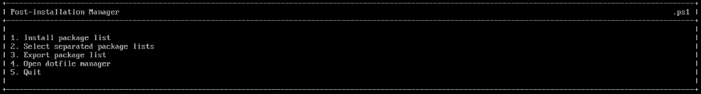
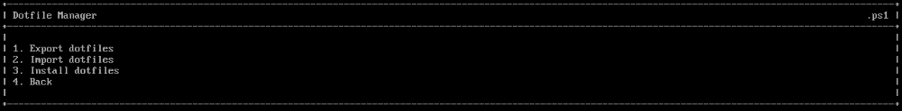

<a id="readme-top"></a>

<!--
<br />
<div align="center">
  <a href="https://github.com/github_username/repo_name">
    
  </a>
</div>
 -->
 
<h3 align="center">Post-Installation Script (pipack)</h3>
  <p align="center">Written in PowerShell.</p>
<br />

<!--
<details>
  <summary>Table of Contents</summary>
  <ol>
    <li><a href="#installation">Installation</a></li>
    <li><a href="#usage">Usage</a></li>
  </ol>
</details>
-->

<!-- ABOUT THE PROJECT -->
# Installation

Clone the repo into your home folder:

   ```sh
   git clone https://github.com/Baebadoobee/postInstallScript.git .pIS
   ```
Make `launcher.sh` and `installationScript.ps1` files executable to ensure they can be run as scripts:
   
   ```sh
   cd .pIS
   chmod +x launcher.sh
   chmod +x installationScript.ps1
   ```

<!-- USAGE EXAMPLES -->
# Usage

After a fresh Arch Linux installation, run the following:

```sh
./launcher.sh
```

The script is parted into two functionalities: A script that installs a preset list of packages and a dotfiles manager.

## Preset package installation

On launch, you will be greeted by a simple TUI.

</img>

### Setting a package list

The used module <a href="modules/postInstallationPackages/postInstallationPackages.psm1">postInstallationPackages.psm1</a> by default searchs for a file called `_packlist` in the packages directory. In this file you can list packages by name. Any commented out line is ignored, as so as any line with `debug` in it.

You can also have multiple package lists in the directory, but you gotta use the "Select separated package lists" option. The correct way to save those lists is in `_yourlistname`, **don't forget the underscore.**

The "Export package list" option gets all the packages you have installed on your system and overwrites the current `_packlist` file.

## Dotfiles Manager

You can access it either via the `installationScript.ps1` or via its own file `_dotfilesManager.ps1`, but it's preferred to be launched by the installation script because it sets up an important environment variable. 

</img>

The Dotfiles Manager itself works as an easy import/export tool, that can also install the desired config files to your system. 

It is preferable that you setup git on your dotfiles folder before trying to export. I also recommend you to check the <a href="scripts/_dotfilesManager.ps1">_dotfilesManager.ps1</a> script and configure the git commands.

The second option uses a simple function, that asks you the link to a repo and clones it.

Last but not least, the "Install dotfiles" option uses the module <a href="modules/newSymlink/newSymlink.psm1">newSymlink.psm1</a>. It simulates a wildcard operation with symlinks, similar to `cp directory/*`.

## Modules 

As you already know, the script uses two modules each can be added to your PowerShell local folder and be used as a command.

To do this run the following:

```sh
cp -rf $HOME/.pIS/modules/* .local/powershell/modules/
```

The module documentation always comes on top of any module file, check that out. I highly recommend you to do this, for customization purposes.

Some usages of the modules:

```pwsh
import-module postInstallationPackage
import-module newSymlink

#idpack
pipack -p your/defined/packlist # Installs a user-defined package list

#slinkf
slinkf -p origin/path -d destination/path # You don't actually have to write -p and -d, the positional parameters take care of it themselves
```

To make the modules persistent you can append that top 3 lines to your powershell profile. If you want to use it directly from your shell, create aliases for each of this commands. Like this:

```sh
alias pipack='pwsh --no-logo -c pipack'
alias slinkf='pwsh --no-logo -c slinkf'
```

</br>

<!-- <style type="text/css">
  p#warning {
    max-width: 60%; 
    font-size: 18px; 
    text-align: left; 
    font-weight: bold; 
    position: relative; 
    margin: 0;
  }
  p#warning:hover {
    color: #f1f1f1;
  }
</style> -->

<p align="right">I am currently working in some problems on the code, errors are likely to occour!</br>Please check out the <a href="doc/ISSUES.md">issues</a> page</p>


##
_For a deeper comprehension, please refer to the modules documentation. I highly recommend you to set your own package list, to personalize your post-installation script._

<p align="right"><a href="#readme-top">back to top</a></p>

### Contributors:

<a href="https://github.com/Baebadoobee/postInstallScript/graphs/contributors">
  
</a>

